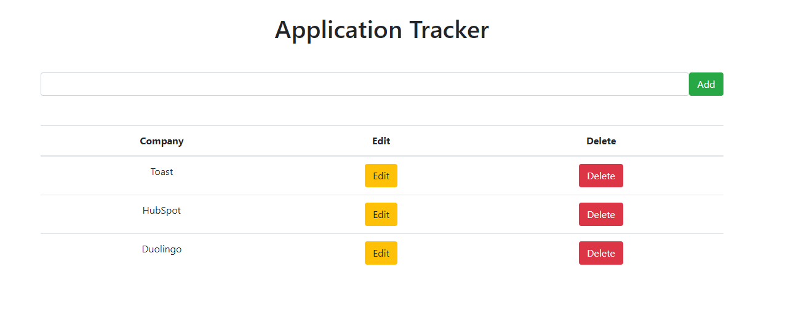

# Job Application Tracker

This is a full-stack web application designed to help you keep track of your job applications!

## Roadmap

In it's current state, it's basically just a to-do list with some updated text, but the goal is to expand this into something that would be a much cleaner and feature-filled version of tracking applications on a spreadsheet. Future features would include:

- Easily sort applications by various filters
- Add metrics to keep track of application statistics
- Track interviews and important dates
- Google sign-in for different users and Gmail/Calendar integration

## How It's Built

This web-app is built so far using the PERN tech stack (PostgreSQL, Express, React, and Node.js)
